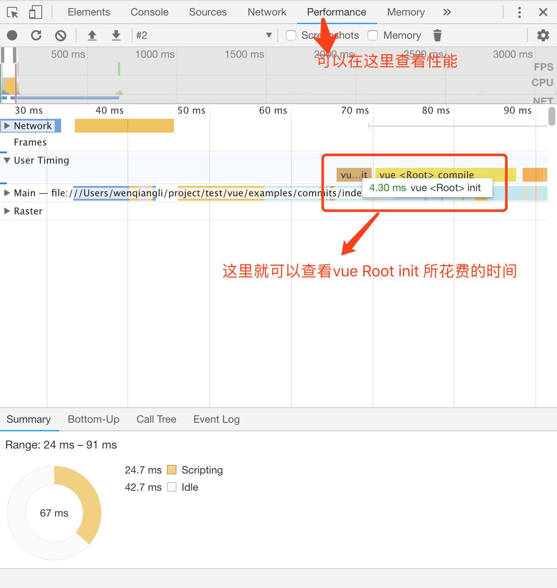

# 第二章 initMixin

```javascript
  initMixin(Vue)
```
```javascript
  export function initMixin (Vue: Class<Component>) {
    Vue.prototype._init = function (options?: Object) {
      // ... _init 方法的函数体，此处省略
    }
  }
```
如上，Vue在[～/vue/src/core/instance/index.js](../../core/instance/#index)中首先会交给[～/vue/src/core/instance/init.js](../../core/instance/init.html)中的initMixin方法来处理，从而给 Vue.prototype 挂载上 _init 方法。也就是我们一开始就遇到的this._init(options)，那么我们看看，这个方法给Vue带来了哪些能力：
1. 给实例 vm 加上唯一标记 _uid
2. 在合适的条件下测量初始化的性能（合适的条件是非生产环境，且运行环境中拥有 mark 等能力，且config.performance==true）
3. 给实例 vm 加上 _isVue，拥有 _isVue 的对象将不会被observed观测
4. 给实例 vm 加上 $options 对象，$options 融合了传入的 options 和 vm.constructor.options 以及 Vue.options
5. 给 vm 添加 _renderProxy 用于代理 vm属性
6. 将 vm 自身通过 _self 暴露出去
7. 给 vm 初始化一些生命周期相关的属性
8. 给 vm 初始化一些事件相关
9. 给 vm 初始化一些渲染相关
10. 触发 beforeCreate 钩子
11. 初始化 inject 相关
12. 初始化 props, methods, data, computed 和 watch
12. 初始化 initProvide 相关
13. 触发 created 钩子
14. 存在 vm.$options.el 情况下 调用 vm.$mount

## 性能相关 

```javascript
  if (process.env.NODE_ENV !== 'production' && config.performance && mark) {
    startTag = `vue-perf-start:${vm._uid}`
    endTag = `vue-perf-end:${vm._uid}`
    mark(startTag)
  }
```

```javascript
  if (process.env.NODE_ENV !== 'production' && config.performance && mark) {
    vm._name = formatComponentName(vm, false)
    mark(endTag)
    measure(`vue ${vm._name} init`, startTag, endTag)
  }
```

如上，这两段代码用于测量之间代码的性能，用到的工具是performance。我们修改全局配置Vue.config.performance=true 将它开启。



关于performance的使用，可以自行百度，该文件位于[～/vue/src/core/util/perf.js](../..//core/util/perf.html)。

## merge options
merge options 分为两种情况，第一种是内部组件，第二种是其它。merge options 后将会给vm添加上 $options对象。
#### 内部组件
内部组件的特征是 options._isComponent==true，内部组件的选项不需要进行特殊处理因此可以直接赋值，直接赋值可以提高性能，具体操作如下：
```javascript

  // 以 vm.constructor.options 为原型对象创造一个空对象，并且赋值给vm.$options
  const opts = vm.$options = Object.create(vm.constructor.options)
  // 用一个个赋值代替列举赋值来提升性能，这里缓存parentVnode，方便后面使用
  const parentVnode = options._parentVnode
  opts.parent = options.parent
  opts._parentVnode = parentVnode

  const vnodeComponentOptions = parentVnode.componentOptions
  opts.propsData = vnodeComponentOptions.propsData
  opts._parentListeners = vnodeComponentOptions.listeners
  opts._renderChildren = vnodeComponentOptions.children
  opts._componentTag = vnodeComponentOptions.tag

  if (options.render) {
    opts.render = options.render
    opts.staticRenderFns = options.staticRenderFns
  }
```
#### 非内部组件
对于非内部组件，生成$options会调用 mergeOptions 方法, 该方法位于[～/vue/src/core/util/options.js](../../core/util/options.html)中。此方法将传递三个参数，其中第二个是实例传入的options，第三个参数是当前实例vm。而第一个参数是
```javascript
resolveConstructorOptions(vm.constructor)
```
这个方法是来解析constructor上的options属性，并且将之返回。